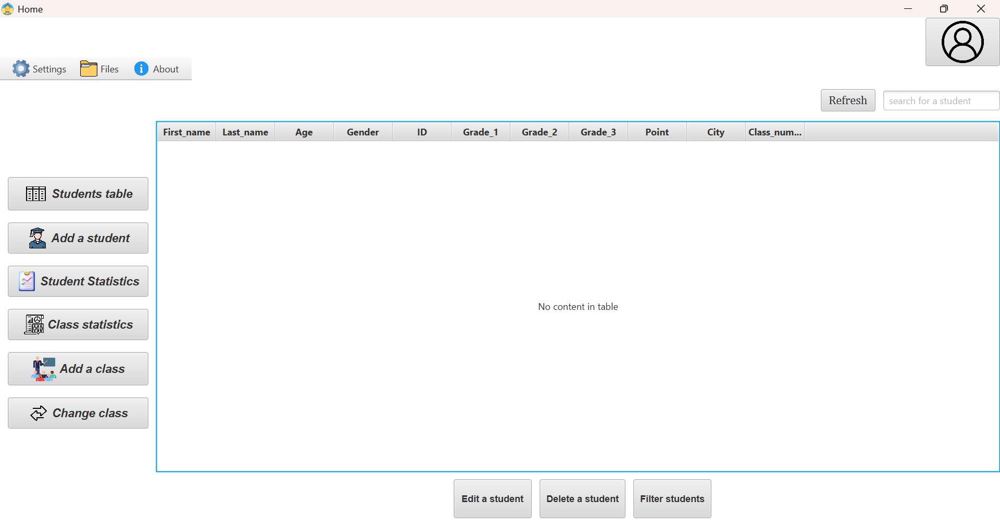
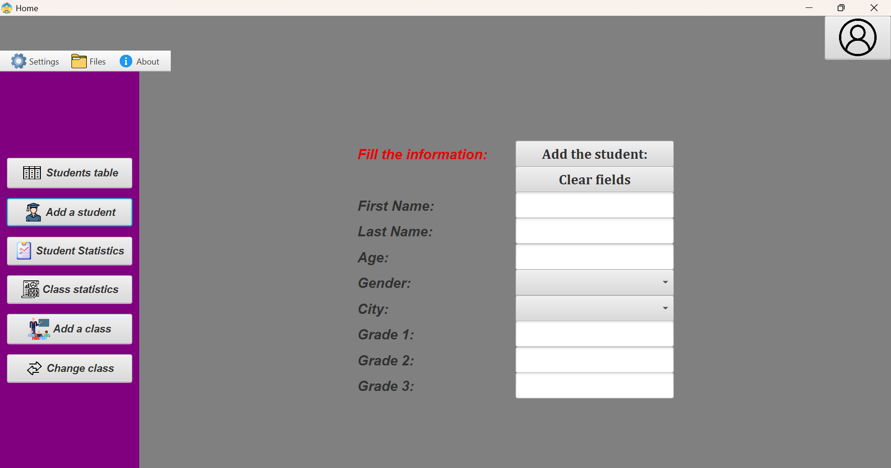
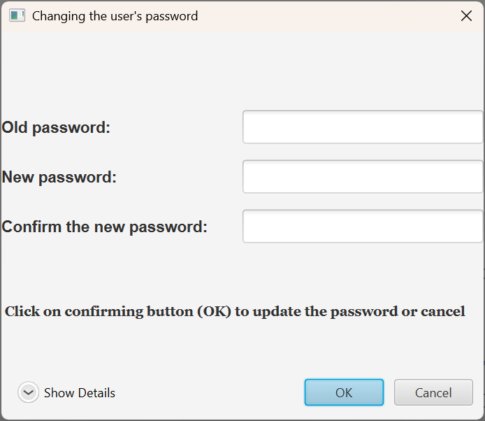

<h1>Students Management System</h1>

- ### introduction.

## About the project :

This project allows you to :
- This is a program about managing students, users, saving-open students data, and saving statistics class file.
- It's a system built with **JavaFx**, **Scene builder**, **Maven, SQLite**, etc.
- This is a new version (3.0.0), and it's a full refactor of the older Swing version (2.7.2).

---

## Technologies used:
* Java 25.
* JavaFx.
* Scene builder.
* Database (SQLITE).
* Jackson library (JSON serialization and deserialization).
* Maven.
* MVC Architecture.
* CSS.

---

## Main features.

* Add/ Edit/ remove students/ filters.
* Auto refresh table.
* Modern UI with **Scene builder**.
* Student and class statistics/ save and open files (only files you create inside the app).
* Database storage.
* About menu, where you can see how to use the app.
* Deleting account, and changing password.

---

## Future improvements:
- Password recovery via Google email.
- Passwords hashing.
- Add database support (MySQl).
- Add multi-languages support (Localization).
- Add multi-classes.
- Let the user enters directly to the program without entering password and name every time, if the user has an account.
- Track files and compare it with the data of the app.
- Showing a timer of 5 minutes, when the user wants to enter a code form Google of forgetting password.

---

## Problems need to be fixed:
- Fix the problem in class number, example : when adding students like five, and then you want to delete a student, 
but not the last student because the problem will not happen. You delete a student, and then you add another student.
the last student who has 5 as the class number will be the same number of the added student after him. 
The last student (5 as class number), the added student (the one after him, 5 as class number). 
This problem will only happen when you delete a student except the last student, and then add a student.

---

## **The developer**
- **Status** : Alone.
- **Github** : [https://github.com/tanjawi-code].
- *Version* : 3.3.2